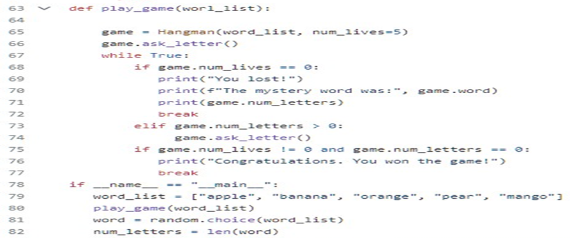

Hangman is a familiar Python terminal word game in which one player guesses a word thought of by his contestant in guessing the letter in it within a fixed number of lives. This Project is an application of what we have learned so far using hangman game that involves two contestants: a user and the computer; where the computer randomly displays a word and the user attempts to guess it by choosing one of its letters. If the user runs out of lives without guessing the right word’s letter he lost.# Hangman
Hangman is a familiar word game in which one player guesses a word thought of by his contestant in guessing the letter (s) in it within a fixed number of lives. This Project is an application of what we have learned so far using hangman game that involves two contestants: a user and the computer; where the computer randomly displays a word and the user attempts to guess it by choosing one of its letters. If the user runs out of lives without guessing the right letter of the word he lost.

[Table of Contents](#)

[Project Title: HANGMAN](#HANGMAN) 	

[INTRODUCTION](#INTRODUCTION)

[DESCRIPTION](#DESCRIPTION)

[INSTALLATIONS INSTRUCTIONS](#INSTALLATIONS-INSTRUCTIONS)

[USAGE INSTRUCTIONS](#USAGE-INSTRUCTIONS)	

[FILE STRUCTURE OF THE PROJECT](#FILE-STRUCTURE-OF-THE-PROJECT)	

[PROJECT MOTIVATION AND CHALLENGES](#PROJECT-MOTIVATION-AND-CHALLENGES):	

[LICENSE INFORMATION](#LICENSE-INFORMATION):

[CONTRIBUTION](#CONTRIBUTION)

[ACKNOWLEDGEMENT](#ACKNOWLEDGEMENT)

[HANGMAN](#HANGMAN) 

                                

[INTRODUCTION](#INTRODUCTION)
 ---                              
Hangman is a familiar Python terminal word game in which one player guesses a word thought of by his contestant in guessing the letter in it within a fixed number of lives. This Project is an application of what we have learned so far using hangman game that involves two contestants: a user and the computer; where the computer randomly displays a word and the user attempts to guess it by choosing one of its letters. If the user runs out of lives without guessing the right word’s letter he lost.

[DESCRIPTION](#DESCRIPTION)

This project is an attempt to test the learner skills on what they have learned in python programming course so far. Using everything learned previously, apply them on game design. Demonstrate skills apprehended on previous leaning, the acquired skills on variables, data types, strings, booleans, control flow, with the use of loops (while and for), functions and error handling. Knowing the python environment is vital, also the different operating Systems, the use of the different command lines such as prompt, git powerShell, file manipulation with editing and so on. 
This is a great opportunity to demonstrate, implement and build a fully functioning Hangman game code program using the different elements and objects we learned up to date - accordingly show off how Python Programming really is builds up from small pieces called objects. These objects, as little simple things that can be add together to build an intricate and complex design – So using these small things to build a fun Hangman game.
The project is organized in milestone to test progressively learner skills:
Milestone 1_ It starts with the prerequisite lesson on the environment set up – on how to install on Git [here](https://git-scm.com/book/en/v2/Getting-Started-Installing-Git) or VS Code using pip install command - how to set up the repository GitHub [here](https://docs.github.com/en/get-started/quickstart/create-a-repo).
 
Milestone 2_ Create the variables for the game and the prerequisite lessons covering all the aspect of Python basics: the use of Google Colab, on how to create variables, comments, numbers, strings Booleans and lists. Here is about variable creation and assign it a value – we work with a list of word, for input request and at the use comparative operator and of if-else conditions.
 
Milestone 3_ Is about prerequisite lessons on sets, tuples, dictionaries, Conda, pip and package managers - Understanding Imports in Python, For Loops, Iteration and Control Flow Trick, and the use of the functions how to create a function - working inside it, and call it at the end. Here we are challenged with the task1, 2 and 3 for use of iteration loops.
  
  
 
Milestone 4_ The project task prerequisites involve dealing with the application of Error Handling with Control Flow, Context Managers, list Comprehensions, Defining Functions – Furthermore, here we deal with advanced skills on how to create a class on Object-Oriented Programming (OOP) and its Design principles, how to make comments using Docstrings syntax compare to comments style.
Obviously, we have explored here the notion of classes in Python: class description and methods, and defined the three concepts: scope concerns and Namespace when dealing with OOP design - design is based on the concept of Intentional Design. It is the time to use constructor __init__ to initialize the attributes of the class Hangman. Code creation often involves the repeated use of the same algorithms.

 
 Thus, it is important to organise and pay attention to your code to save, avoid the common drawbacks with long lines reuse the same algorithm to increase code flexibility, also by incorporating placeholders in functions or methods. 
 
 
Milestone 5_ It is about putting all object things together and implement the play_game () function, where the class is called to create an occurrence of the game, which instantiate the user interaction:

 
Into a play game function that ending with the use of the magic method __name__==”__main__” that defines the behavior of Hangman class should do when some particular python syntax 

 
Manipulating folders, files and repositories, and for any changes to make update process, from GitHub to VS Code and conversely. How to write documents using the text editor markdown on VS Code or on Google Colab, it was a great experience to discover with this course these power tools for code and text writing, editing, formatting and son.

[INSTALLATIONS INSTRUCTIONS](#INSTALLATIONS-INSTRUCTIONS)

There no special libraries requirement, only the use of standards python installation, Colab environment, or VS Code to play Hangman game, git install command is the basic.

To play the game, the user must install python first in their local machine or command line, and follow the following instructions on about how to clone the repository and how to run the game with the python code:
-	Clone the Hangman game repository link to your local machine: For that the user must have a repository on the free GitHub website https://github.com/ to create a new account.
-	Once your account is open click on the link https://github.com/JesusAs2019/hangman that lead you to the game repo.
-	Then click on green Code icon on top corner, copy the link and clone it on your local machine.
-	Navigate to the project directory on typing: cd Hangman.
-	Now you can run the game python HANGMAN.py
Let the game beginning, you have 6 attempts, so, guess a letter to uncover the python programming language game!

[USAGE INSTRUCTIONS](#USAGE-INSTRUCTIONS)

This game is a standard application of the Python project where the complete version can be downloaded in my GitHub Repository to play the on any python command lines.
•	Randomly selects a programming language from a predefined list.
•	Displays the word with * for unguessed letters.
•	Handles input validation for single-letter guesses.
•	Tracks guessed letters and remaining attempts.
•	Announces wins or loses based on player performance.

[FILE STRUCTURE OF THE PROJECT](#FILE-STRUCTURE-OF-THE-PROJECT)

The project Hangman folder JesusAs2019/hangman is organized into 7 (seven) files: 
Hangman - script with TODOs from template, README.md foile followed by the practice codes include milestone_2.py file, milestone_3_task_1_2.py, milestone_3_task_3.py, and  milestone_4.py - at tthe you have finally the complete Hangman code into MILESTONE_5.py where thr user can [play the game](C:\Users\vicky\OneDrive\Documents\GitHub\hangman\milestone_5.py)

[PROJECT MOTIVATION AND CHALLENGES](#PROJECT-MOTIVATION-AND-CHALLENGES)

The project was created for the AiCore bootcamp program to give me an opportunity to practice my Python skills, as an evaluation to progress through the program.
Lesson learned: What I have learned significant how to implement and practice basic and advanced python syntax: create lists, functions and classes, using methods to execute the flow of the code. The use of if-elif and loops conditions was a bit challenge as well as the calling of the different functions, but with a lot commitment and consistency we have overcome the issues to make work a good version of Hangman game. 
for my career life - from chemical research background this project is for me an opportunity to see where I can stand in my perspective of changing career with something innovative. 

[LICENSE INFORMATION](#LICENSE-INFORMATION)

Not available, since it is not a protected project.

[CONTRIBUTION](#CONTRIBUTION)

All contributions are welcome!  And feel free to open issues or submit pull requests to improve the game, add features, or fix any bugs.
Author: Jean Pierre Assiana

[ACKNOWLEDGEMENT](#ACKNOWLEDGEMENT) 

My gratitude to the AiCore engineers support team for their dedicated support and guidance. They continuously provided assistance and was always willing and passionate to help in any way as they could all over the project.

